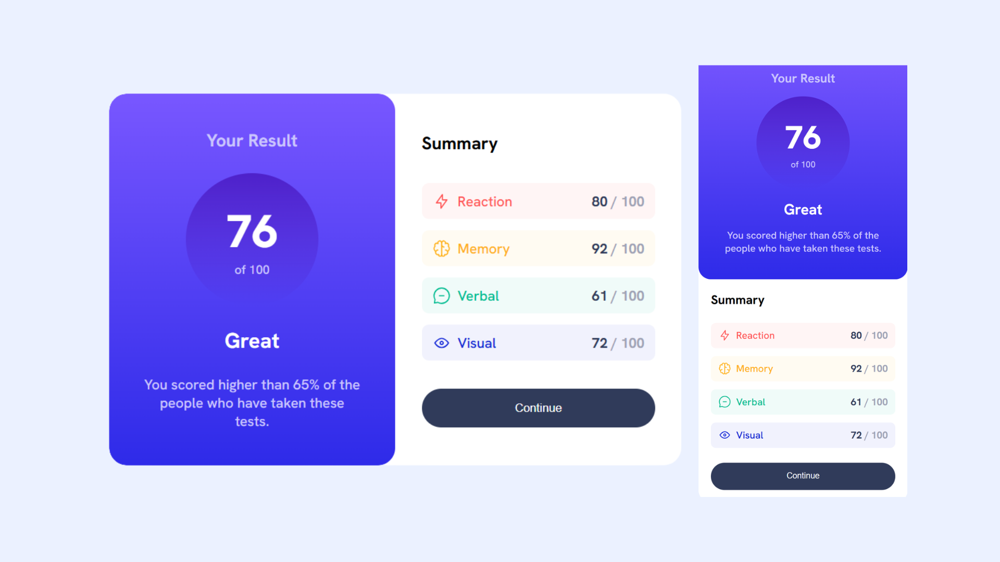

## Overview
A responsive results summary component built with HTML and CSS. This project focused on recreating the provided design while practicing responsive layouts, gradients, and component styling.

### Key learnings
- Creating layouts with Flexbox.
- Working with CSS gradients.
- Styling reusable card components.
- Building responsive interfaces with media queries.

## Project
- Live Site URL: https://daxitaseervi.github.io/results-summary/

## Links
- Twitter/X: [https://x.com/kazzyyy__](https://x.com/kazzyyy__)
- Codepen: [https://codepen.io/Daxita-Seervi](https://codepen.io/Daxita-Seervi)
- Frontend Mentor: [https://www.frontendmentor.io/profile/daxitaseervi](https://www.frontendmentor.io/profile/daxitaseervi)
